## Баги на странице со скриншота

**1. [Кнопка “Найти”]** Орфографическая ошибка. "Найт" вместо "Найти"

Приоритет: low  

**2. [Фильтр Длительный срок]** Цепь следования поиска указывает на "Длительный срок" аренды, хотя поиск посуточной аренды. Вероятно опечатка, либо нарушена логика. Ставлю средний. Необходима проверка в динамике. 

Приоритет: medium  

**3. [Неверное отображение города на карте]** Отображается карта другого города в поисковой выдаче. СПб вместо Москвы.
Исходя из того, что в предложенный вариантах фигурирует также локации из Лен. области, то вероятно нарушено логика поиска. 

Приоритет: high  
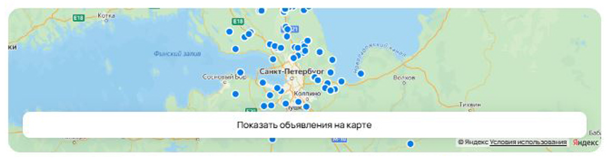

**4. [Отличие боковой панели от прода]** Баг под *. Вероятно, макет изменился. Но есть отличие в порядке расположения и наличии функционала боковой панели.
Ставлю LOW т.к. под *

Приоритет: low  
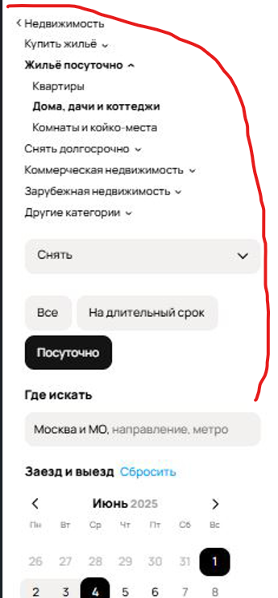
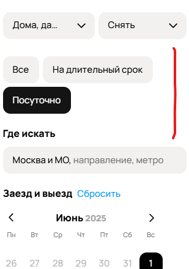

**5. [Отображение на карте]** Отображение объявлений в виде плиток вместо визуализации на карте.

Приоритет: high  

**6. [Фильтр "По дате" не работает]** Объявления не отсортированы от по дате, однако фильтр активирован. 

Приоритет: high  
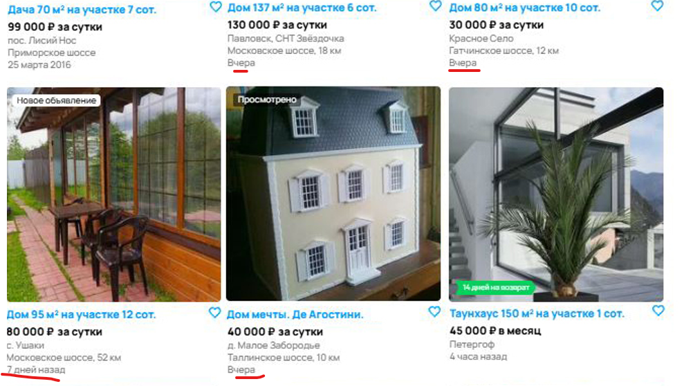

**7. [Отображение локации в выдаче неверное]** В выдаче показаны результаты из Лен. области, но поиск идет по Москве и МО. Вероятно нарушена логика 

Приоритет: high  
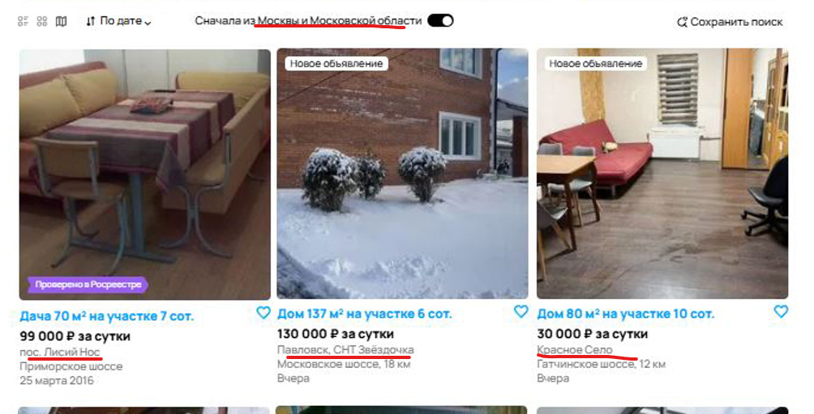

**8. [Аренда с оплатой в месяц в выдаче посуточных аренд]** Выдает результат аренды с оплатой в месяц, хотя выбрана посуточная оплата. Нарушена логика поиска.

Приоритет: high 
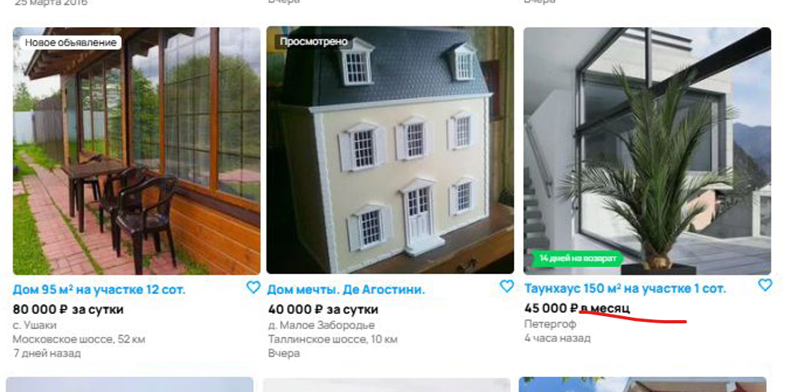

**9. [Ярлык "14 дней на возврат" на объявлении об аренде]** Имеется ярлык "14 дней на возврат" на объявлении об аренде. 
При сравнении с продом такого не найдено. Маловероятно, что аренду можно вернуть. На руках нет требований - поэтому считаю за баг.  

Приоритет: low  

**10. [Кукольный дом в выдаче об аренде]** Вероятно, объявление не прошло модерацию, т.к. на фото изображен кукольный дом.
Возможно, остальные фото нормальные, нет возможности просмотреть. Поэтому- ставлю medium. Если все фото подобные - то high  

Приоритет: medium  

**11. [Фильтр пешком от метро 5 минут не функционирует]** Выделяю отдельным багом. Помимо бага в отображении локации, 
это отдельный фильтр, который также не функционирует. Не может быть 5 минут от метро, дома в области.

Приоритет: high  
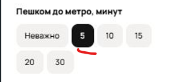

**12. [Фильтр ограничения по цене не функционирует]** При ограничении бюджета до 50 000, отображает результаты выше данной стоимости.
Не работает критичный функционал.

Приоритет: high 
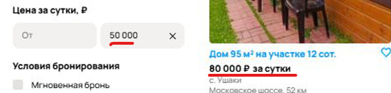

**13. [Ярлык "Новое объявление" на объявлении недельной давности]** Новое объявление не может быть 7 дней назад.

Приоритет: medium 
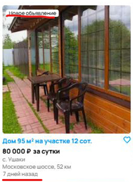

**14. [Кнопка показа результатов деактивируется при отсутствии результатов]** Если сравнивать с продом - то доолжны быть показаны схожие по параметрам запросы.
Кнопка должна быть активна. А текст "Ничего не найдено" и пояснение будет после выполнения поиска. Ставлю high потому что
у посетителей должен быть выбор для принятия решения, иначе это сильно ограничивает возможности сервиса.

Приоритет: high 

**15. [Показано больше результатов при указании, что найдено 6]** Мы находимся на 4-ой странице поиска и даже на ней отображено 9 результатов.
Без динамичного тестирования сложно сказать в чем именно проблема.
Возможно просто опечатка, либо нарушена ключевая логика. Ставлю поэтому middle.

Приоритет: middle 

**16. [Пояснение "Ничего не найдено" при наличии результатов]** В конце поиска пишет пояснение, что ничего не найдено. Видимо,
забыли снять.

Приоритет: low

**17. [Мало предложений для рекомендаций по  схожим требованиям]** На руках нет требований, возможно это не баг. Но, судя по проду,
рекомендации должны заполнять страницу до конца. В любом случае можно добавить как рекомендацию к следующему релизу.

Приоритет: low
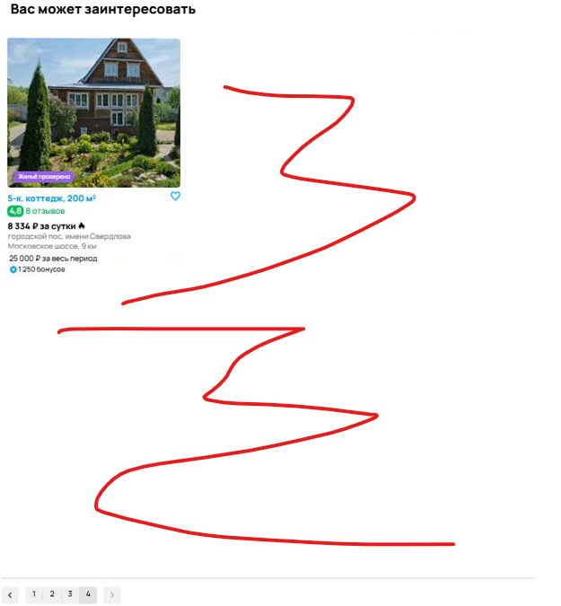

**18. [Выделено преимущество "Доставка" для объявления об аренде]** Имеются ярлыки и подпись "Доставка" для объявления об аренде. 
Необходимо проверить как такое возможно. Либо ограничить возможность указания в объявлении, либо бак в коде.

Приоритет: middle
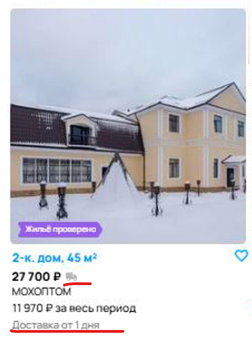

**19. [Продажа окон в выдаче об аренде]** Можно объединить с BUG10, если проблема аналогичная. Скорее всего проблема с модерацией.
Объявление не релевантно.

Приоритет: middle

**20. [Опечатка в футере "коко-места"]** Необходимо исправить опечатку на "коЙко-места" в футере .

Приоритет: low
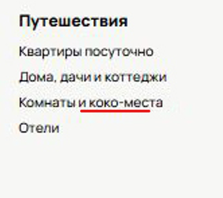